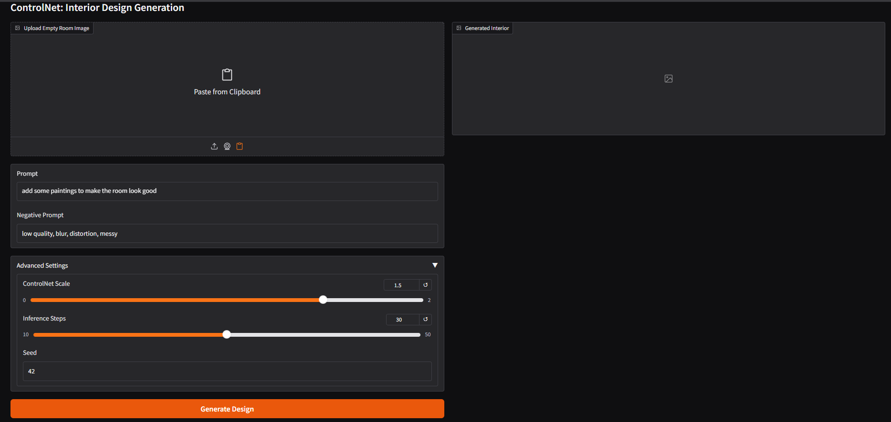
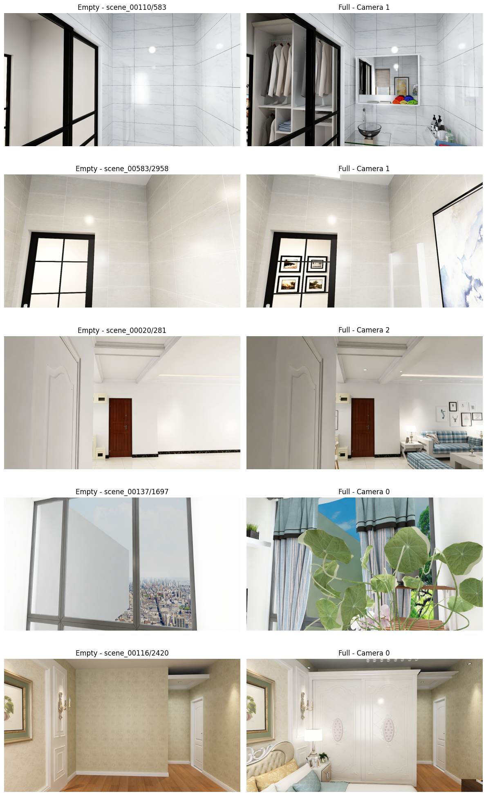
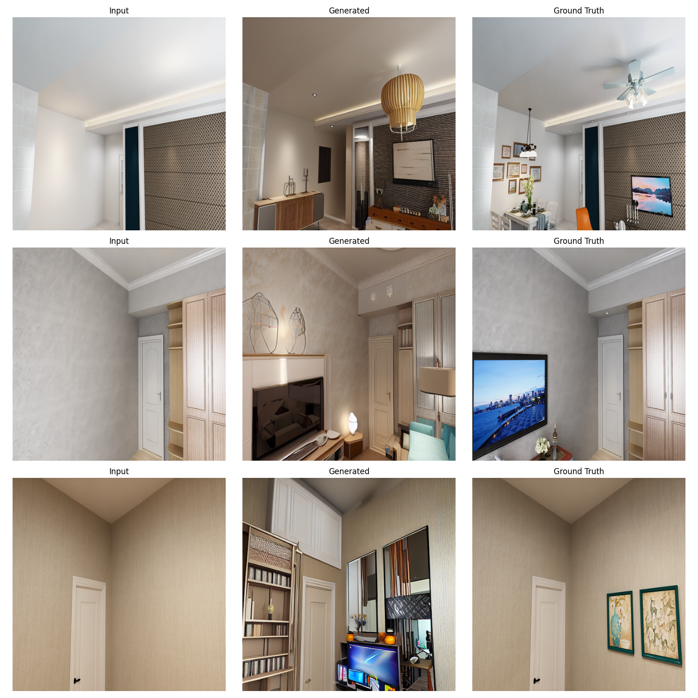
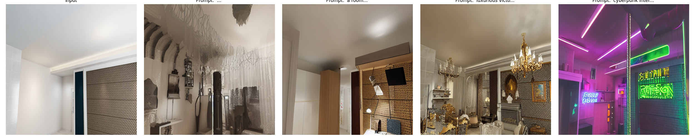
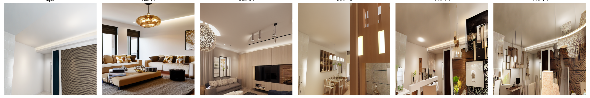
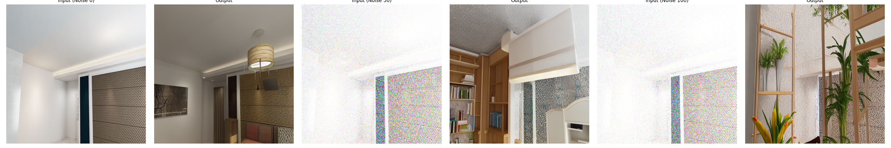
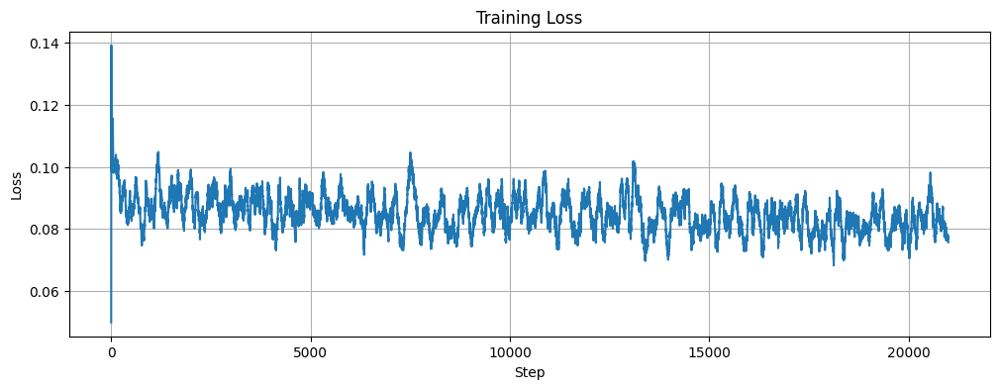

# Generative Interior Design: Controlling Stable Diffusion with Structural Priors

This project implements a domain-specific **ControlNet** to automate the staging of interior spaces. By conditioning Stable Diffusion v1.5 on perspective geometry, we convert images of empty rooms into photorealistic, furnished interiors while preserving the original structural constraints (walls, floors, windows).

**Model:** [HuggingFace - interior_sd](https://huggingface.co/dyinghorizon/interior_sd)  
**Dataset:** Structured3D (Perspective Partition)

---

## 🚀 Project Notebooks

| Component | Colab Notebook | Description |
| :--- | :--- | :--- |
| **1. Data** | [Open in Colab](https://colab.research.google.com/drive/1rTgboPZ-f0exjz24CNZyEi1gjqLlEyXt#scrollTo=3f500020-eea4-4dbe-a66e-b49d3a58ccfa) | Download, filtering, and pairing of Structured3D data. |
| **2. Training** | [Open in Colab](https://colab.research.google.com/drive/1mx32OKiAJd2APJvuLoo9mKloxC6Z_JUY#scrollTo=de5c281d-9533-40e7-bcc2-988b6de56e46) | Training ControlNet from Depth-init weights for 25k steps. |
| **3. Evaluation** | [Open in Colab](https://colab.research.google.com/drive/1YAQ3V8U8PjRNZ7ymotn7H44EjrJh2Bwi#scrollTo=CvvqvBvbnRG7) | Quantitative (SSIM/LPIPS) and qualitative analysis. |
| **4. Demo UI** | [Open in Colab](https://colab.research.google.com/drive/1FHOI25vlglt5StxxEX_1KspEsQnPFPi2?authuser=1#scrollTo=iZpMW88gvbdq) | **Interactive Gradio App for real-time inference.** |

### ⚡ Quick Start (Demo)
To try the model on your own images:
1. Open the **Gradio UI** notebook linked above.
2. **Run Cell 1** to install dependencies and launch the web interface.
3. Upload an image of an empty room and type a prompt (e.g., *"a modern bedroom"*).

---

## 🖼️ Results

### Dataset Curation
We constructed a robust pipeline to align "Empty" perspective views with "Full" furnished ground truths.

### Generative Filling
The model successfully identifies floor planes and corners to place furniture coherently without hallucinating new room geometry.

*(Left: Empty Input | Middle: Generated Interior | Right: Ground Truth)*

### Stylistic Control
We can render the **exact same room** in different architectural styles by modifying the text prompt.

*(Styles: Modern Minimalist, Rustic Wooden, Cyberpunk Neon)*

---

## 📊 Ablation Studies

### Conditioning Scale
We analyzed how strictly the model adheres to the input structure. A scale of **1.0** provides the optimal balance between structural fidelity and creative furniture placement.

### Robustness to Noise
We injected noise into the control image to test geometric robustness. The model retains structure even with significant degradation.

### Training Dynamics
The model was trained for 25,000 steps. Convergence was achieved around step 15,000.

---

## 👥 Team 17
* Nishad Bagade (MT2024102)
* Sriram Bharadwaj (MT2024114)
* Ashutosh Jadhav (MT2024063)
